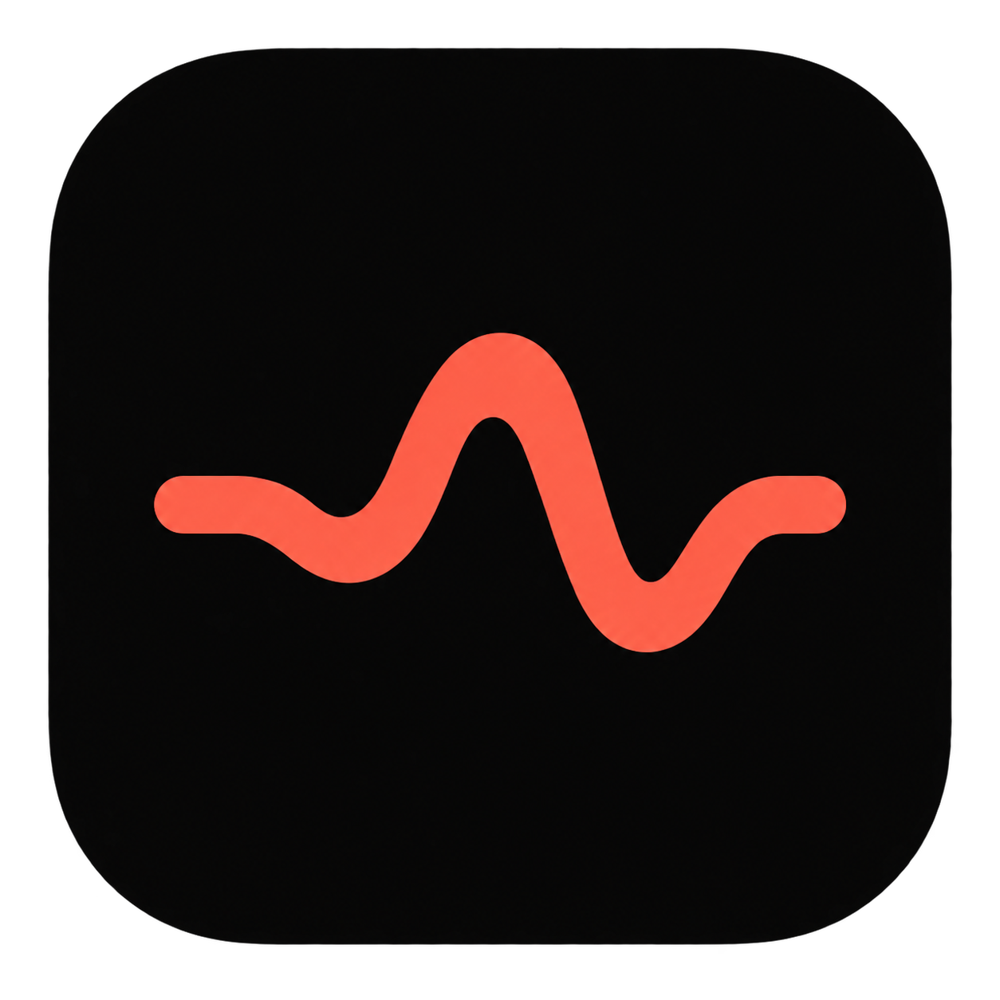

<p align="center">
  
</p>

<h1 align="center">Pulse Notch</h1>

<p align="center">
  A quiet, expandable activity surface for the MacBook notch.
</p>

<p align="center">
  Pulse Notch started as a personal tool for my own workflow: I wanted the notch
  to tell me when coding agents and GitHub Actions finished, while keeping my next
  calendar event close without adding more notification noise.
</p>

## Demo

<p align="center">
  <a href="Docs/Assets/pulse-notch-demo.mov">
    
    />
  </a>
</p>


## Installation

Install with Homebrew:

```sh
brew install --cask paugarcia32/tap/pulse-notch
```

Alternatively, download the DMG from the
[latest GitHub release](https://github.com/paugarcia32/pulse-notch/releases/latest)
and drag Pulse Notch to Applications.

Pulse Notch is ad-hoc signed and not notarized. On first launch, macOS may require
allowing it from System Settings > Privacy & Security.

To build from source:

```sh
git clone https://github.com/paugarcia32/pulse-notch.git
cd pulse-notch
./Scripts/run-app.sh
```

The script builds, ad-hoc signs, registers, and opens `.build/Pulse Notch.app`.
Launching the executable directly with `swift run PulseNotch` is not supported
because macOS cannot reliably associate privacy permissions with a standalone
SwiftPM executable.

## System requirements

- macOS 14 Sonoma or newer.
- An Apple Silicon Mac. Intel builds are not currently distributed.
- Swift 6 or newer when building from source.
- A Mac with or without a physical notch. External displays use a compact fallback.
- The GitHub CLI (`gh`) is optional and only required for GitHub activity.

## What it shows

- A prioritized summary of the next event, active work, agent usage limits, media,
  and anything that needs attention.
- Upcoming Calendar events, including meeting links and configurable reminders.
- Running and recently completed Codex, Claude Code, Cursor Agent, Antigravity,
  and OpenCode sessions.
  Codex and OpenCode subagents are grouped under their parent session; Claude Code
  subprocesses are grouped with their ancestor Claude Code process.
  OpenCode desktop activity is detected by read-only checks of unfinished responses
  in its local session database while the app is open. Pulse Notch stores no copy;
  closing OpenCode stops detection, and no extra permission is needed.
- Open pull requests, reviews, checks, and Actions from repositories selected in
  Settings, including workflows triggered by pushes and tags.
- Active browser downloads and Homebrew operations.
- Now Playing controls, artwork, and playback progress.
- Charging, volume, brightness-key presses, and Bluetooth-headphone activities.
  Automatic display-brightness adjustments do not trigger the notch indicator.
- Stopwatch and timer activity.
- Multiple displays, Spaces, full-screen apps, keyboard shortcuts, and configurable
  collapsed indicators.
- An optional AI Agent page for chat, desktop tasks, goals, and daily routines. It is
  off until you enable it.

Pulse Notch is not intended to replace Notification Center. It keeps a small number
of useful, time-sensitive signals visible and stays out of the way until expanded.

## AI Agent (optional)

The AI Agent page lets you chat with an agent, delegate tasks on your Mac, track
goals with explicit completion criteria, and schedule daily or weekday routines. It
is off by default: enable it in **Settings → Pages → AI Agent**, then finish setup
from the **Settings** tab on the AI Agent page. The page uses a larger 640×520 surface
(smaller on small displays), stays open when the pointer leaves so drafts are kept,
and collapses on Esc or a click elsewhere without stopping work.

Two provider roles are configured independently:

| Role | Hosted | Local |
|---|---|---|
| Decisions: action choice, target selection, risk checks, outcome verification | JEV through TypeSafe's System One API (API key) | Laya, managed by Pulse Notch or an existing System One-compatible service |
| Conversation, planning, and visual reasoning | OpenRouter (API key and model) | A managed `llama.cpp` server, or an existing OpenAI-compatible server |

All four combinations work. Pulse Notch calls a configuration *fully local inference*
only when both providers run on your Mac; tasks that use online apps still reach the
network.

**Hosted setup.** Choose JEV and OpenRouter, paste the TypeSafe and OpenRouter keys,
choose a model from the catalog (capabilities and prices are shown) or enter a model
ID, review what is sent, and select **Test connection**.

**Managed local setup.** Choose *Laya (managed on this Mac)* and *Local model
(managed on this Mac)*, then select **Install** for each component. Nothing is
downloaded before you do. Installed components are reused offline and can be removed
individually. You can also import a compatible GGUF model and its vision projector.

**Connect an existing service.** Enter a Laya-compatible System One endpoint
(for example `laya-serve`) and an OpenAI-compatible endpoint with a manual model ID.
Keys are optional; the presets use loopback addresses.

**Computer use.** Turn on *Allow computer use* and grant Accessibility (required) and
Screen Recording (optional, for screenshots). A model is allowed to control the Mac
only after **Test connection** verifies a real tool call; screenshots are offered only
to models that also pass a vision check. The agent prefers accessible controls and
falls back to coordinates only on a current screenshot. Runs are autonomous by
default; *Supervised* mode asks before each action, and you can deny or allow specific
apps by bundle identifier. Each run is limited to 50 actions or 10 minutes by default
(editable per goal and routine). After two failed replans it pauses with an
explanation. One desktop task runs at a time; others queue. The agent waits while the
Mac is locked or asleep and while you type in its composer.

Use **Pause**, **Resume**, and **Stop** on any run, or the global emergency stop
**⌃⌥⌘.** (configurable under Shortcuts). Stopping prevents further actions and cancels
inference; it does not undo completed actions.

**Goals and routines.** Saving a goal does not start it; choose **Run**. A goal
completes only when the decision provider confirms the observed screen satisfies its
criteria, and the evidence is shown with the result. Routines use an IANA time zone
(your current one by default), run while Pulse Notch is open, and run at most once per
occurrence, including across daylight-saving changes. Occurrences missed while the
Mac was asleep or Pulse Notch was closed are listed with **Run now**; they are never
replayed automatically. Runs interrupted by quitting are marked for review, not
repeated. Launch at login uses the existing *Open at login* setting.

## Privacy and permissions

Pulse Notch processes activity locally and does not include telemetry. The optional
AI Agent sends data only to the providers you configure, as described below.

- Calendar access is requested only when Calendar features are enabled. Event data
  stays in memory and refreshes every 30 seconds.
- Coding-agent detection reads local process and session metadata, never prompts or
  conversation contents.
- GitHub activity refreshes every 30 seconds through the authenticated official
  `gh` CLI and never reads or stores its token. Selected repository names are saved
  locally; removing a repository in Settings stops monitoring it.
- Downloads monitoring observes the selected local folder and can be disabled.
- Battery, Bluetooth, volume, brightness, and media state are read locally and kept
  in memory.
- When the brightness indicator is enabled, Pulse Notch listens for brightness-key
  events and reads the current brightness only after a key press. It does not store
  keystrokes. macOS may require Input Monitoring access to deliver these events
  while another app is focused; without it, the brightness indicator may not appear.
- Update checks query the public GitHub Releases API at most once per day and can be
  disabled in Settings.
- AI Agent (off by default):
  - Credentials for TypeSafe, OpenRouter, and optional local endpoints are stored in
    the macOS Keychain. **Disconnect** removes them.
  - With a hosted decision provider, each step sends the instruction, the proposed
    action, and the names and values of up to 60 relevant on-screen controls. The
    decision provider never receives screenshots.
  - With a hosted language model, the conversation and observed screen text are sent.
    Screenshots are sent only to models that pass the vision check, and only when the
    agent captures one.
  - Secure fields are never read, sent, typed into, or logged. Screen content is
    treated as task data, never as instructions that change permissions or rules.
  - Screenshots stay in memory and are discarded after use. Conversations, run
    summaries, goals, and routines are stored in a local SQLite database under
    `~/Library/Application Support/Pulse Notch/AIAgent`. History is kept for 30 days
    by default and can be cleared. Goals and routines are kept until you delete them.
  - Managed runtimes are downloaded only when you select Install. They run as child
    processes that listen only on loopback (`llama.cpp` requires a per-launch key)
    or on private pipes (Laya). They receive a minimal environment and none of Pulse
    Notch's desktop permissions. They stop when you disable the agent or quit.
  - Disabling the AI Agent cancels every run and stops managed processes. Deleting
    history and downloaded models is a separate, explicit action.
- Apart from the optional AI Agent keys, no credentials are stored by Pulse Notch.

Each integration can be disabled from Settings. macOS requests Calendar, Bluetooth,
or Downloads access only when the corresponding feature needs it. Accessibility and
Screen Recording are requested only when you turn on computer use for the AI Agent.

### Third-party runtimes and models

The optional managed components are pinned, with checksums, in
[`RuntimeManifest.json`](Sources/PulseNotchApp/Resources/AIAgent/RuntimeManifest.json):

| Component | Version | License |
|---|---|---|
| [python-build-standalone](https://github.com/astral-sh/python-build-standalone) CPython | 3.12.14+20260924 | PSF-2.0 |
| [laya-mlx](https://github.com/mizorewww/laya-mlx) and dependencies (hash-locked) | 0.2.0 | Apache-2.0 and others |
| [Laya Multilingual MLX](https://huggingface.co/aac6fef/laya-multilingual-mlx) (from `convaiinnovations/laya-multilingual`) | `f2b4faf` | Apache-2.0 |
| [llama.cpp](https://github.com/ggml-org/llama.cpp) server, Metal | b11146 | MIT |
| [MiMo-V2.6-Distill-Qwen-9B GGUF](https://huggingface.co/ggml-org/MiMo-V2.6-Distill-Qwen-9B-GGUF) Q8_0 and vision projector | `81baddc` | MIT |

These components are not bundled with Pulse Notch. They are downloaded from their
publishers only when you install them. The MiMo package needs about 10.2 GB of disk
space and at least 16 GB of memory. It uses its embedded, adapted chat template.

### AI Agent troubleshooting

- **"Not ready for computer use":** run **Test connection**. The model must return a
  structured tool call; text alone does not qualify. Choose a model that supports tools.
- **Screenshots unavailable:** the model did not pass the vision check, or Screen
  Recording is not granted. macOS applies a new Screen Recording grant after Pulse
  Notch restarts.
- **Actions do nothing:** grant Accessibility in System Settings → Privacy & Security,
  and remove and re-add Pulse Notch if you updated the app.
- **"Insufficient context":** the local Laya model accepts 1,024 tokens. The task needs
  more than that. Simplify the window or instruction, or use JEV.
- **Run waits:** the Mac is locked, another desktop task holds control, or the agent
  composer is focused. Click elsewhere to release it.
- **Downloads fail or stall:** select **Retry**; downloads resume where they stopped.
  A checksum mismatch deletes the file. Check free disk space; the installer requires
  the download size plus 10%.
- **Local model does not start:** check free memory; MiMo Q8_0 needs 16 GB or more.
  Removing and reinstalling *llama.cpp* replaces the runtime without touching models.
- **Missed routines:** routines run only while Pulse Notch is open. Use **Run now**
  on the missed occurrence, or enable *Open at login*.

## Development

Settings use an AppKit window created by `SettingsWindowController` before its
SwiftUI content is installed. This lets the sidebar and detail backgrounds extend
behind the transparent titlebar; the menu bar item and ⌘, open that window.

Build and open the app without launching it automatically:

```sh
./Scripts/run-app.sh --no-open
```

Build the ad-hoc signed release DMG and its SHA-256 checksum:

```sh
./Scripts/build-dmg.sh
```

The release artifacts are written to `dist/`.
See [Docs/RELEASING.md](Docs/RELEASING.md) for the release process.

Run the test suite:

```sh
swift test
```

The project uses Swift 6, SwiftUI, AppKit where needed, Swift Package Manager, strict
concurrency checking, and Swift Testing. Domain behavior lives in `PulseNotchCore`;
macOS UI and integrations live in `PulseNotchApp`.

## Contributing

Contributions are welcome. Please read [CONTRIBUTING.md](CONTRIBUTING.md) before
opening an issue or pull request.

## Inspiration

Pulse Notch is heavily inspired by [Alcove](https://tryalcove.com/),
[Boring Notch](https://github.com/TheBoredTeam/boring.notch), and
[Atoll](https://github.com/Atoll-Labs/Atoll). Those apps helped establish what a
native notch utility can feel like; Pulse Notch builds on that idea with the agent,
GitHub Actions, usage-limit, and workflow features that matter most to my own setup.
